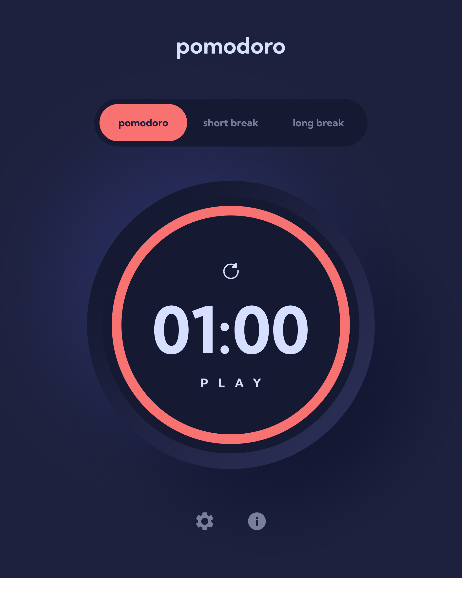

# FEM Pomodoro App

Elevate productivity with this Pomodoro-inspired timer, perfect for focused work. Seamlessly switch between work and breaks, utilizing short and long break features. Optimize your workflow, achieve balance, and effortlessly boost productivity.

## Table of contents

- [Overview](#overview)
  - [Preface](#preface)
  - [Features](#features)
  - [To Add Features](#to-add-features)
  - [Screenshot](#screenshot)
  - [Links](#links)
- [My process](#my-process)
  - [Built with](#built-with)
  - [What I learned](#what-i-learned)
  - [Continued development](#continued-development)
  - [Useful resources](#useful-resources)
- [Author](#author)
- [Acknowledgments](#acknowledgments)

## Overview

### Preface

This is a solution to the [Pomodoro app challenge on Frontend Mentor](https://www.frontendmentor.io/challenges/pomodoro-app-KBFnycJ6G). Frontend Mentor challenges help you improve your coding skills by building realistic projects.

### Features

- **Timer Modes:** Switch between Pomodoro, short break, and long break modes. 
- **Flexible Timers:** Customize target times to suit your needs.
- **Interactive Progress Display:** A dynamic circular progress bar visually tracks your timer progress.
- **Personalized Appearance:** Customize colors and fonts for a personalized experience.
- **Notification Alerts:** Receive notifications when timers start and finish for added convenience.
- **Progressive Web App (PWA) Capability:** Install the app like a native application for easy access across devices.
- **Offline Availability:** Use the app even without an internet connection, ensuring uninterrupted productivity.

### To Add Features

- **Automatic Timer Mode Switch Option:** Implement functionality to offer users the option to automatically switch between Pomodoro, short break, and long break modes

- **Ability to Display Pomodoro Count on That Day:** Enable the app to showcase the number of completed Pomodoro sessions for the current day, aiding users in tracking their daily productivity.

### Screenshot

### Links

- Solution URL: ---> [LINK](https://www.frontendmentor.io/solutions/fem-pomodoro-app-using-html-css-and-vanilla-javascript-g8E78rx7dm)
- Live Site URL: ---> [LINK](https://fempomodoro.netlify.app/)

## My process

### Technologies Used

- SASS/SCSS for efficient styling
- BEM (Block Element Modifier) Architecture for structured CSS
- MVC (Model-View-Controller) Architecture for organized code structure
- NPM (Node Package Manager) for package management
- Mobile-first Workflow for responsive design
- Webpack for module bundling and optimization
- HTML Semantic Tags for structured and meaningful markup

### What I learned

Oh boy! Where do I begin? This Frontend Mentor Challenge has provided me with the densest and most valuable knowledge I've acquired so far.

At first, similar to my previous Frontend Mentor projects, I intended to write this code quickly without much consideration for quality. However, everything changed when I watched a [video](https://www.youtube.com/watch?v=GEr--yTShz8&t=394s) from one of my favorite C++ channels, [The Cherno](https://www.youtube.com/@TheCherno/). In it, he emphasized that the time spent on a project doesn't guarantee its quality. If you only focus on coding without learning, the resulting code might not be of high quality. His words deeply resonated with me because I had been approaching these Frontend Mentor challenges merely to test my coding speed and project completion time.

This realization inspired me to step out of my comfort zone and delve into more research and learning. In fact, I dedicated more time to learning.

Here's a summary of the things I've learned throughout this process.

1. **Open Graph (OG):** Understanding how OG tags control the display of content on social media platforms.
  
2. **Accessibility:** Ensuring your app is usable by all, considering diverse needs and disabilities.
  
3. **Search Engine Optimization (SEO):** Optimizing your app to rank better in search engine results.
  
4. **BEM (Block Element Modifier) Architecture:** Structuring CSS for better readability and scalability.
  
5. **MVC (Model View Controller) Architecture:** Organizing code into models, views, and controllers for better code organization.
  
6. **Progressive Web App (PWA):** Building web apps that offer native app-like experiences and functionalities.
  
7. **ES12 Classes:** Utilizing the class syntax introduced in ECMAScript 12 (ES2022). Especially private properties.
  
8. **Closure:** Getting the hang of closures in JavaScript for encapsulation was a huge moment. Funny enough, I'd heard about this concept ages ago, but diving in made me truly get it. You know what they say: experience really is the best teacher.
  
9. **Local Storage:** Storing data within the user's browser for data management.
  
10. **Node Package Manager (NPM):** Coding with just HTML, CSS, and vanilla JavaScript? It's like digging a hole with bare hands, so much effort! But finding out about this whole NPM thing? Total game-changer! Even though I'm only scratching the surface with bundling JS modules, I know diving deep into NPM will seriously level up my game and make life way easier.

**Note: I might add more content here when I regain motivation.**
