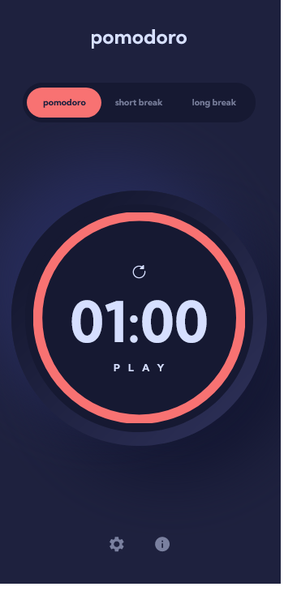

# FEM Pomodoro App

Elevate productivity with this Pomodoro-inspired timer, perfect for focused work. Seamlessly switch between work and breaks, utilizing short and long break features. Optimize your workflow, achieve balance, and effortlessly boost productivity.

## Table of contents

- [Overview](#overview)
  - [Preface](#preface)
  - [Features](#features)
  - [To Add Features](#to-add-features)
  - [Screenshot](#screenshot)
  - [Links](#links)
- [My process](#my-process)
  - [Built with](#built-with)
  - [What I learned](#what-i-learned)

## Overview

### Preface

This is a solution to the [Pomodoro app challenge on Frontend Mentor](https://www.frontendmentor.io/challenges/pomodoro-app-KBFnycJ6G). Frontend Mentor challenges help you improve your coding skills by building realistic projects.

### Features

- **Timer Modes:** Switch between Pomodoro, short break, and long break modes. 
- **Flexible Timers:** Customize target times to suit your needs.
- **Interactive Progress Display:** A dynamic circular progress bar visually tracks your timer progress.
- **Personalized Appearance:** Customize colors and fonts for a personalized experience.
- **Notification Alerts:** Receive notifications when timers start and finish for added convenience.
- **Progressive Web App (PWA) Capability:** Install the app like a native application for easy access across devices.
- **Offline Availability:** Use the app even without an internet connection, ensuring uninterrupted productivity.

### To Add Features

- **Automatic Timer Mode Switch Option:** Implement functionality to offer users the option to automatically switch between Pomodoro, short break, and long break modes

- **Ability to Display Pomodoro Count on That Day:** Enable the app to showcase the number of completed Pomodoro sessions for the current day, aiding users in tracking their daily productivity.

### Screenshot

### Links

- Solution URL: ---> [LINK](https://www.frontendmentor.io/solutions/fem-pomodoro-app-using-html-css-and-vanilla-javascript-g8E78rx7dm)
- Live Site URL: ---> [LINK](https://fempomodoro.netlify.app/)

## My process

### Technologies Used

- SASS/SCSS for efficient styling
- BEM (Block Element Modifier) Architecture for structured CSS
- MVC (Model-View-Controller) Architecture for organized code structure
- NPM (Node Package Manager) for package management
- Mobile-first Workflow for responsive design
- Webpack for module bundling and optimization
- HTML Semantic Tags for structured and meaningful markup

### What I learned

Oh boy! Where do I begin? This Frontend Mentor Challenge has provided me with the densest and most valuable knowledge I've acquired so far.

At first, similar to my previous Frontend Mentor projects, I intended to write this code quickly without much consideration for quality. However, everything changed when I watched a [video](https://www.youtube.com/watch?v=GEr--yTShz8&t=394s) from one of my favorite C++ channels, [The Cherno](https://www.youtube.com/@TheCherno/). In it, he emphasized that the time spent on a project doesn't guarantee its quality. If you only focus on coding without learning, the resulting code might not be of high quality. His words deeply resonated with me because I had been approaching these Frontend Mentor challenges merely to test my coding speed and project completion time.

This realization inspired me to step out of my comfort zone and delve into more research and learning. In fact, I dedicated more time to learning.

Here's a summary of the things I've learned throughout this process.

1. **Open Graph (OG)**
2. **Accessibility**
3. **Search Engine Optimization (SEO)**
4. **BEM (Block Element Modifier) Architecture**
5. **MVC (Model View Controller) Architecture** 
6. **Progressive Web App (PWA)** 
7. **ES12 Classes**
8. **Closure** 
9. **Local Storage** 
10. **Node Package Manager (NPM)** 
11. **Profiling**
12. **Destructuring Assignment**
13. **Modules**
14. **Input Validation**
15. **Timer**

**Note: I might add more content here when I regain motivation.**
